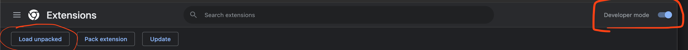
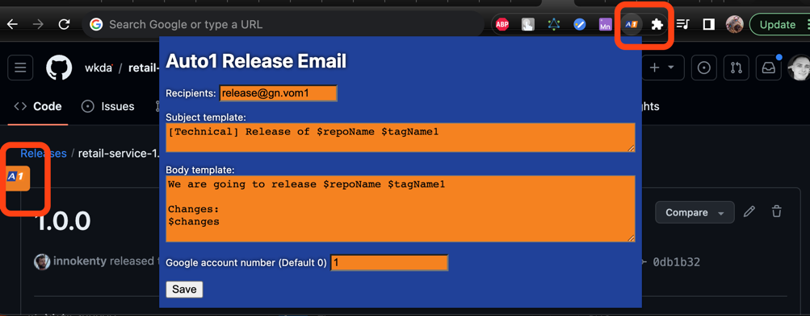

# Auto1 release-email

### Overview
Extension create a link to compose email with predefined recipients, subject and body from github tag.

**Restriction: Very long changes will not work as it contains in the URL** 

### Installation
  * Fetch or download repository (unarchived)
  * Open chrome://extensions/
  * Enable developer mode (see screen)
  * Load unpacked and select unarchived folder

### Usage:
  * Setup recipients, templates, and google account if you have few accounts. (menu top right corner)
  * Click button on the left side of the specific release tag page (If absent reload the page)

### Support
Fill free to ping me if any problem or suggestion. Also Pull requests much welcome.